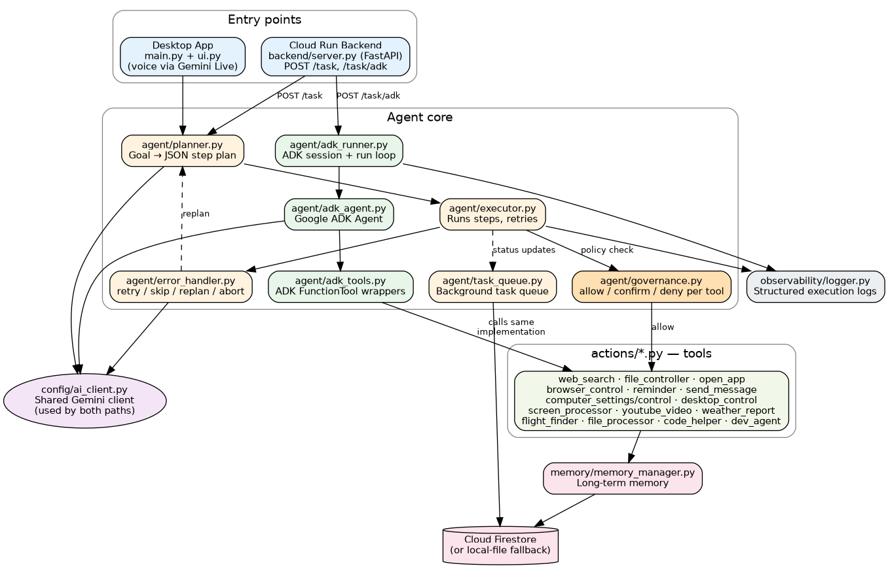

# Liya — Autonomous AI Agent

Liya is a voice-and-text autonomous AI agent that plans multi-step goals,
executes them against real tools on your machine (files, apps, browser,
web search, reminders, messaging, and more), and runs the same tool set
either locally as a desktop app or remotely as a Cloud Run backend.

Given a goal like *"research mechanical engineering and save it to a
notepad file"*, Liya breaks it into steps, runs each step against a real
tool, recovers from failures by replanning, and reports back — without
the user specifying each individual action.

**Built for CALL-E: Your Code Is Calling.** Liya isn't a chatbot that
writes text about a task — it's handed a messy, multi-step chore
(research something, edit a file, message someone, book something,
*call* someone) and it plans the steps, calls the real tools, recovers
from failures by replanning, and reports back with proof of what it
actually did. One of those real tools is [CALL-E](https://github.com/CALLE-AI/call-e-integrations):
Liya can place a real outbound phone call to get a goal-driven phone
task done (`actions/call_e.py`), gated behind the same
allow/confirm/deny governance every other real-world-side-effect tool
goes through.

**The actual hackathon submission is a standalone, PR-ready Agent
Skill**, not this whole repo — see
[`hackathon-submission/`](hackathon-submission/) for
`appointment-call-confirm`, a focused CALL-E skill that automates a
real business chore (calling to confirm tomorrow's appointments so
no-shows don't eat the day) and stands on its own without any of
Liya's agent-framework machinery. This repo is the context for why
that skill exists and proof its CALL-E integration is real, not just
described.

---

## Quick start

```bash
git clone https://github.com/Lancheba/Liya-v1.git
cd Liya-v1
python setup.py
```

`setup.py` installs everything in `requirements.txt` and the Playwright
browsers `actions/browser_control.py` needs.

Then just run the desktop app:

```bash
python main.py
```

On first launch, with no `config/api_keys.json` present yet, a setup
popup appears asking for your Gemini API key and OS — enter it once,
submit, and Liya writes `config/api_keys.json` itself and goes live.
No manual config file editing needed.

To see the designated demo scenario run end-to-end with a live trace
instead (no UI, no server needed — useful once `config/api_keys.json`
already exists from the step above):

```bash
python demo/run_demo.py
```

**Judges/reviewers:** the fastest way to see the actual submission is
[`hackathon-submission/skills/appointment-call-confirm/SKILL.md`](hackathon-submission/skills/appointment-call-confirm/SKILL.md)
— a self-contained skill you can read start to finish in a few
minutes. If you want to see CALL-E's Developer API called live from
this repo instead, see [`JUDGE_TESTING.md`](JUDGE_TESTING.md).

Full setup detail, backend/Cloud Run instructions, and tool governance
are documented below.

---

## How it's put together



Diagram source: [`diagrams/architecture.dot`](diagrams/architecture.dot)
(Graphviz) and [`diagrams/architecture.mmd`](diagrams/architecture.mmd)
(Mermaid, renders natively on GitHub). Plain-text fallback:

```
                    ┌────────────────────────────┐
   Voice / Text ──► │        main.py / ui.py     │   Desktop app (local)
                    │  Gemini Live voice loop     │
                    └────────────────┬───────────┘
                                     │
                    ┌────────────────▼───────────┐
                    │        agent/planner.py     │  Breaks goal -> JSON step plan
                    │        agent/executor.py     │  Runs each step, handles retries
                    │        agent/error_handler.py│  Decides retry / skip / replan / abort
                    │        agent/governance.py   │  allow / confirm / deny per tool
                    │        agent/task_queue.py   │  Background task queue + status
                    └────────────────┬───────────┘
                                     │
              ┌──────────────────────┼──────────────────────┐
              ▼                      ▼                      ▼
      actions/*.py tools     agent/adk_agent.py     observability/logger.py
      (web_search, files,     (Google ADK agent,      (structured execution
       apps, reminders,        same tools, ADK's        logs / trace)
       browser, etc.)          own run loop)
              │
              ▼
      memory/memory_manager.py  ──>  Firestore (or local JSON fallback)

Remote / hackathon-judge access:
   backend/server.py (FastAPI) ──> Cloud Run ──> same planner/executor/ADK agent
```

Two execution paths exist side by side:

- **Legacy path** (`agent/planner.py` → `agent/executor.py`): a Gemini
  call produces a JSON step plan against a fixed tool list, then the
  executor runs each step and can replan on failure. This is what
  `main.py` (desktop) and `POST /task` (backend) use today.
- **Google ADK path** (`agent/adk_agent.py` / `agent/adk_runner.py`): a
  real `google.adk.agents.Agent` with the same underlying action tools
  wrapped as ADK `FunctionTool`s, run through ADK's own agent loop and
  session handling. Exposed via `POST /task/adk`. See
  [`WRITEUP.md`](WRITEUP.md) for why both exist.

---

## Project layout

| Path | What it is |
|---|---|
| `main.py` | Desktop entry point — voice loop (Gemini Live), tool dispatch, UI wiring |
| `ui.py` | PyQt desktop UI (`LiyaUI`) |
| `agent/planner.py` | Turns a goal into a JSON step plan (legacy path) |
| `agent/executor.py` | Executes a plan step by step, handles `generated_code` fallback |
| `agent/error_handler.py` | Classifies step failures: retry / skip / replan / abort |
| `agent/governance.py` | Per-tool policy: `allow` / `confirm` / `deny` (see below) |
| `agent/task_queue.py` | Background task queue backing `POST /task` |
| `agent/adk_model.py` | `LiyaGemini` — ADK model wired to Liya's shared Gemini client |
| `agent/adk_tools.py` | ADK `FunctionTool` wrappers around 10 of the actions below plus `memory_tool` (remember/forget), each gated through `agent/governance.py` (see below) |
| `agent/checkpoint_store.py` | Step-level checkpoint/resume: persists completed steps per task (Firestore or local-file fallback) so an interrupted task resumes instead of restarting from step 1 |
| `agent/adk_agent.py` | Builds the real ADK `Agent` |
| `agent/adk_runner.py` | Runs a goal through the ADK agent + session |
| `actions/*.py` | Individual tools: web search, file control, app launching, reminders, browser control, computer control/settings, screen analysis, messaging, flight search, YouTube, code helper/dev agent, CALL-E phone calls |
| `memory/memory_manager.py` | Long-term memory read/write (Firestore-backed, local-file fallback) |
| `memory/config_manager.py` | Reads/writes `config/api_keys.json` |
| `observability/logger.py` | Structured execution logging |
| `backend/server.py` | FastAPI backend for Cloud Run (see `backend/README_DEPLOY.md` for deployment) |
| `config/ai_client.py` | Single source of truth for the Gemini model + client (used by both execution paths) |

---

## Local setup

**Requirements:** Python 3.12+, a Gemini API key.

```bash
git clone <this-repo>
cd Liya-main

python setup.py
```

`setup.py` installs everything in `requirements.txt` and the Playwright
browsers used by `actions/browser_control.py`.

Then create `config/api_keys.json`:

```json
{
  "gemini_api_key": "YOUR_GEMINI_API_KEY",
  "os_system": "windows",
  "calle_api_key": "YOUR_CALLE_API_KEY",
  "calle_base_url": "https://api.heycall-e.com"
}
```

`os_system` is one of `windows` / `mac` / `linux` and controls which
OS-specific launchers (`actions/open_app.py`, `actions/desktop.py`, etc.)
are used.

`calle_api_key` / `calle_base_url` are optional — only needed if you want
Liya to place real outbound phone calls via `actions/call_e.py`. Get a key
by following [CALL-E's install guide](https://github.com/CALLE-AI/call-e-integrations);
new accounts include 20 free calls. Same config precedence as the Gemini
key below: local file first, `CALLE_API_KEY` / `CALLE_BASE_URL` env vars
as the Cloud Run fallback.

**Config precedence — local file vs. environment variables.**
`config/ai_client.py` and `config/firestore_client.py` read from
`config/api_keys.json` first (used above for local/desktop runs). That
file is never baked into the Cloud Run image — instead, the deployed
container falls back to environment variables set from Secret Manager:
`GEMINI_API_KEY` (see `cloudbuild.yaml`'s `--set-secrets`) and
`GOOGLE_CLOUD_PROJECT` (`--set-env-vars`). Same code path, same two
config values, just sourced differently depending on where it's running
— nothing hardcoded into the image either way.

Run the desktop app:

```bash
python main.py
```

Run the backend locally instead (no Docker needed):

```bash
LIYA_API_KEY=dev python backend/server.py
curl http://localhost:8080/health
```

Full Cloud Run deployment steps live in
[`backend/README_DEPLOY.md`](backend/README_DEPLOY.md).

---

## Tool governance

Every tool has a policy in `agent/governance.py` — `allow` (runs
immediately), `confirm` (needs user confirmation; auto-denied in
headless/cloud unless pre-approved), or `deny`. Defaults:

| Tool | Policy |
|---|---|
| `web_search`, `weather_report`, `flight_finder`, `youtube_video`, `open_app` | allow |
| `file_controller`, `reminder` | allow |
| `send_message`, `call_e` | confirm |
| `computer_settings`, `computer_control`, `desktop_control`, `code_helper`, `dev_agent` | confirm |

This is overridable per-deployment via `tool_governance` in
`config/api_keys.json`.

---

## Actions catalog

| Tool | Purpose |
|---|---|
| `web_search` | Web search, or compare mode across multiple items |
| `file_controller` | List/read/write/move/copy/rename/delete files, find files, disk usage |
| `open_app` | Launch a desktop application by name |
| `browser_control` | Drive a real browser: navigate, click, type, scroll, read text |
| `computer_settings` | Change OS settings via natural-language intent detection |
| `computer_control` | Low-level input: type, click, hotkey, screenshot, screen-find |
| `desktop_control` | Wallpaper, organize/clean desktop, scheduled desktop tasks |
| `screen_processor` | Analyze the current screen or camera view |
| `send_message` | Send a message via a messaging platform |
| `reminder` | Schedule a one-time reminder notification |
| `youtube_video` | Play, summarize, or find trending YouTube videos |
| `weather_report` | Weather lookup by city |
| `flight_finder` | Flight search between two cities on a date |
| `file_processor` | Process/analyze uploaded files |
| `code_helper` | Write/edit/run/explain code |
| `dev_agent` | Multi-step coding tasks |
| `call_e` | Place a real outbound phone call via [CALL-E](https://github.com/CALLE-AI/call-e-integrations) to accomplish a goal-driven phone task and return a (optionally structured) result. See [`hackathon-submission/`](hackathon-submission/) for the standalone `appointment-call-confirm` skill built on this same API. |

---

See [`WRITEUP.md`](WRITEUP.md) for the problem statement, architecture
rationale, and the designated demo scenario.

---

## Try it: the designated demo scenario

```bash
python demo/run_demo.py
```

Runs a real multi-tool goal (web search → save a file → set a reminder)
through the actual task queue and prints the execution trace live as it
happens. See [`WRITEUP.md`](WRITEUP.md#designated-demo-scenario) for
details and the HTTP/ADK variants.

---

## Evidence - proving each claim, not just stating it

Every script below runs real code paths against the real task queue -
nothing here is mocked or simulated for the demo.

| Claim | Proof script | What it actually shows |
|---|---|---|
| Multi-tool autonomous execution | `python demo/run_demo.py` | web_search -> file_controller -> reminder chained from one goal, live trace |
| Memory changes planning, not just storage | `python demo/demo_memory_recall.py` | Writes a preference via `memory.remember()`, then shows the `plan.memory_applied` trace event proving the planner received it as context |
| Governance actually blocks/allows on the ADK path | `python demo/demo_governance.py` | Runs the same goal through the real ADK agent twice — once with no consent (`send_message` blocked), once with `auto_approve=True` (it runs) — via the live `check_tool_permission()` call, not a mock |
| Failure -> analyze -> replan -> recover | `python demo/demo_failure_recovery.py` | Induces a real write failure (unwritable path), streams `step.failure` -> `plan.replan` -> `step.success` from the real `error_handler.py`/`executor.py` loop |
| Checkpoint / resume after interruption | `python demo/demo_checkpoint_resume.py` | Cancels a real multi-step task mid-run, then resubmits the same `task_id` with `resume=True` — proves already-completed steps are skipped, not re-run |
| Google ADK agent path | `python demo/run_demo_http.py --url http://localhost:8080 --key dev --adk` | Same goal run through `agent/adk_runner.py`'s real `InMemoryRunner` session loop |
| CALL-E phone calls gated by governance, same as send_message | `python demo/demo_call_e.py` (add `--live` + `CALLE_API_KEY` to actually place a call) | Runs the real ADK agent against `call_e_tool` — blocked with no consent, allowed with `auto_approve=True`, via the live `check_tool_permission()` call |
| Batch CALL-E confirmation calls, standalone (the hackathon submission) | `python hackathon-submission/skills/appointment-call-confirm/scripts/place_confirmation_calls.py --in hackathon-submission/skills/appointment-call-confirm/assets/sample_appointments.csv` (dry run; add `--confirm` + `CALLE_API_KEY` to actually call) | Calls CALL-E's Developer API directly, with no Liya/ADK dependency, against a batch of appointments — dry-run list, then serial calls, structured per-recipient results |
| Background/async execution | `POST /task` returns a `task_id` immediately; poll `GET /task/{task_id}` later | Task keeps running after the HTTP request returns |
| Full execution trace, not just a final answer | `GET /task/{task_id}/trace` | Every plan/step/replan/failure event, queryable per task |

---

## Known limitation — Gemini free-tier rate limits

`web_search`'s primary backend is Gemini itself; on a free-tier API key
it can hit `429 RESOURCE_EXHAUSTED` under repeated use, since
search-grounded requests have tighter quotas than plain text generation.
When that happens, `actions/web_search.py` falls back to DuckDuckGo
(`ddgs`), then Bing scraping — both of which can also fail from a
datacenter IP (cloud egress is more likely to get rate-limited by these
than a residential one). If all backends fail, the step fails cleanly
and `error_handler.py` replans rather than crashing — the same recovery
path exercised deliberately in `demo/demo_failure_recovery.py`. Fix:
attach billing to the Gemini API key (Google AI Studio → API Keys →
Activate billing) to raise the quota well above free-tier limits.

This fallback chain doesn't affect `appointment-call-confirm` — the
CALL-E hackathon submission — which doesn't call `web_search` at all.